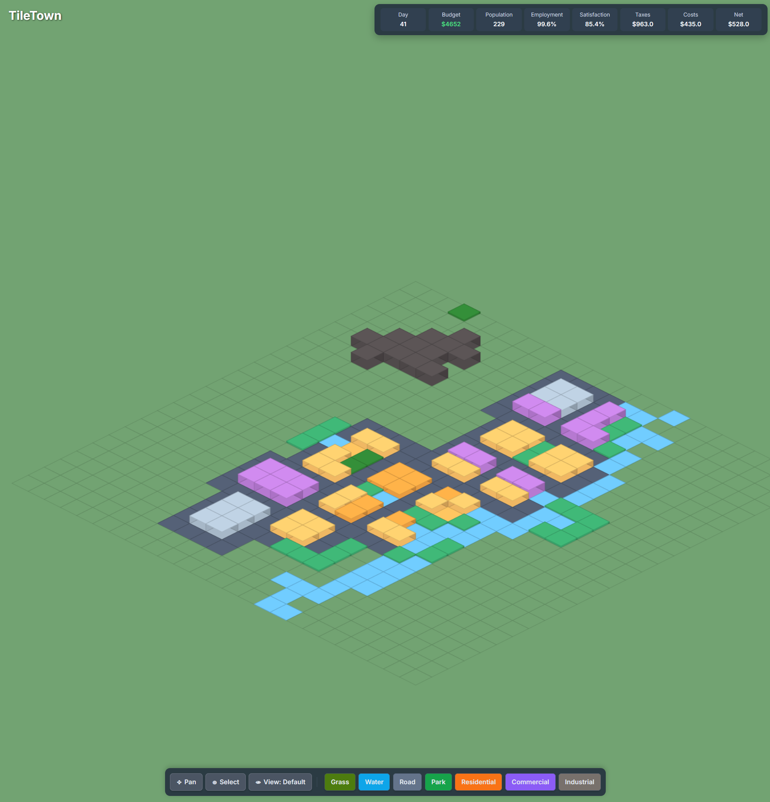

# 🏘️ TileTown: A Mini City Simulator

Welcome to TileTown! Build, manage, and grow your own little isometric city. Zone areas, provide amenities, and watch your town flourish (or struggle!).



## ✨ Features

*   **🗺️ Isometric Map:** Classic city-builder perspective.
*   **🏗️ Build & Zone:**
    *   Roads
    *   Grass & Water
    *   Parks (Player & Natural)
    *   Mountains
    *   Residential Zones
    *   Commercial Zones
    *   Industrial Zones
*   **📈 Basic Simulation:**
    *   💰 Budget Management (Initial funds, tile costs, carry costs, taxes)
    *   🧑‍🤝‍🧑 Population Growth
    *   📈 Employment Rate
    *   😊 City & Tile Satisfaction (for residential)
    *   🏭 Operational Score (for commercial/industrial)
    *   ⬆️ Buildings visually upgrade/downgrade based on conditions.
    *   ⏳ Zones develop into buildings over time if conditions are met (road access).
*   **🔍 UI & Controls:**
    *   🖱️ Pan, Select, and Build modes.
    *   ♨️ Satisfaction Heatmap view.
    *   ℹ️ Info panel for selected tiles.
    *   📊 Top stats bar for key city metrics.
    *   💬 Message pop-ups for game events.
    *   ↔️ Single-row, scrollable build toolbar with icons.
*   **🌍 Procedural Map Generation:** Unique map layout each time with mountains, water, and initial parks.

## 🚀 How to Run

1.  **Prerequisites:**
    *   Node.js (version specified in `.nvmrc`, currently `v23.10.0`). We recommend using [nvm](https://github.com/nvm-sh/nvm) to manage Node.js versions.
        ```bash
        nvm install
        nvm use
        ```
2.  **Install Dependencies:**
    ```bash
    npm install
    ```
3.  **Run Development Server:**
    ```bash
    npm run dev
    ```
    This will start the Vite development server, and the game should automatically open in your default web browser.

4.  **Build for Production:**
    ```bash
    npm run build
    ```
    This will create a `dist` folder with the optimized production build. You can then serve the contents of this folder.

## 🛠️ Technologies Used

*   **TypeScript:** For type-safe JavaScript development.
*   **Vite:** Fast frontend build tool.
*   **HTML5 Canvas:** For rendering the game.
*   **Tailwind CSS:** For utility-first styling.
*   **PostCSS & Autoprefixer:** For CSS processing.

## 🔮 Future Ideas (Potential Enhancements)

*   More building types and levels.
*   Services (police, fire, schools, hospitals).
*   Power and water utilities management.
*   Traffic simulation.
*   More complex economic factors (land value, demand).
*   Disasters.
*   Zoom functionality.
*   Save/Load game state.
*   Sound effects and music.

---

Happy building! 🏙️
